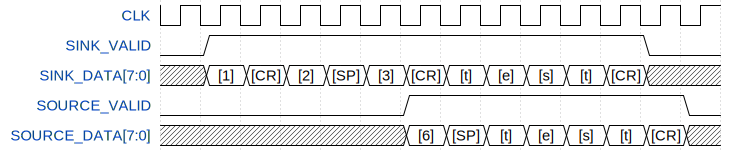

# AtCoder_beginners_Selection_VHDL

AtCoder に登録したら解くべき精選過去問 10 問を VHDL で解いてみた.

[AtCoder Beginners Selection - AtCoder](https://atcoder.jp/contests/abs)

## 環境

VHDLのテストベンチシミュレーションにはQuartus付属のModelSimを使用しています.
またシミュレーションの実行時にGNU Makeを使用するため, Windows Subsystem for Linux(WSL)が使える環境が望ましいです.

- Quartus Prime 18.0.0 Build 614 04/24/2018 SJ Lite Edition
- ModelSim - Intel FPGA Starter Edition 10.5b 2016.10
- Altera Nios2 Command Shell 18.0 Build 614 or
    Windows Subsystem for Linux(WSL) Ubuntu 16.04.6 LTS

## Usage

`./ABC***/` 以下のディレクトリに問題ごとのプロジェクトがあります. 問題のテストケースの実行は各ディレクトリで行うことができます.

### テストケースの実行

テストケースの実行はGNU makeを使って実行できます.

```bash
$make check
```

## 構成

ディレクトリの構成は以下のとおりです.

```
.
├── ABC***
│   ├── Makefile
│   ├── pld
│   │   └── ABC***.vhd
│   └── testbench
│       ├── TB_ABC***.sv
│       └── testcase
│           ├── in
│           │   └── ***.txt
│           └── out
│               └── ***.txt
└── package
```

各問題は`/ABC**/`以下のプロジェクトに分かれています. 問題の解答コードは`pld/ABC**.vhd`, テストケースを実行するテストベンチファイルは`testbench/TB_ABC***.SV`です. テストケースの入出力ファイルは`testbensh/testcase/`にあります. その他の共通コードは`./packeage/`以下にあります. 特にテストケースの実行はほとんど`./package/TB_CHECK.sv`で記述されています. 

## 入出力

ここではFPGAがUARTに接続していて, 入力をすべてASCIIコードで受け取ることとしています. IOは以下のようにします. `SINK_VALID`が有効のとき, `SINK_DATA`から8bitのASCIIコードを一つずつ受け取り, 解答は`SOURCE_VALID`を有効にして`SOURCE_DATA`からASCIIコードで出力します.

| Name             | I/O  | P/N  | Description       |
| ---------------- | ---- | ---- | ----------------- |
| RESET_n          | I    | N    | Reset             |
| CLK              | I    | P    | Clock             |
| SINK_READY       | O    | P    | Sink data ready   |
| SINK_VALID       | I    | P    | Sink data valid   |
| SINK_DATA[7:0]   | I    | P    | Sink data         |
| SOURCE_VALID     | O    | P    | Source data valid |
| SOURCE_DATA[7:0] | O    | P    | Source data       |

ここで例としてpractice contestのA問題, [A: はじめてのあっとこーだー（Welcome to AtCoder）](https://atcoder.jp/contests/practice/tasks/practice_1)の入力例1と出力例1をタイムチャートで示します.



<!--
{ signal: [
  { name: "CLK", wave: 'n.............' },
  { name: "SINK_VALID",  wave: "01..........0."},
  { name: "SINK_DATA[7:0]",  wave: "x===========x.",
   data: ["[1]", "[CR]", "[2]", "[SP]", "[3]", "[CR]", "[t]", "[e]", "[s]", "[t]", "[CR]"] },
  { name: "SOURCE_VALID",  wave: "0.....1......0" },
  { name: "SOURCE_DATA[7:0]",  wave: "x.....=======x", 
   data: ["[6]", "[SP]", "[t]", "[e]", "[s]", "[t]", "[CR]"] },
]}
-->

カギ括弧(`[]`)で囲われた文字はASCII文字を示します. 数字の1を表す`[1]`はバイナリで`0x32`, キャリッジリターン(`CR`)`[CR]`は`0x0d`, スペース`[SP]`は`0x20`です. 

```
1
2 3
test
```

が

```
[1][CR][2][SP][3][CR][t][e][s][t][CR]
```

として入力されます. ここで改行が`CR`になっていますが, これはUARTの慣例です.

解答として

```
6 test
```

は

```
[6][SP][t][e][s][t][CR]
```

として出力します. このとき, 出力は入力を受け取っている途中ですでに出力していますが, 入力と出力は非同期としています. 


## License

MIT License

## Author

[toms74209200](<https://github.com/toms74209200>)